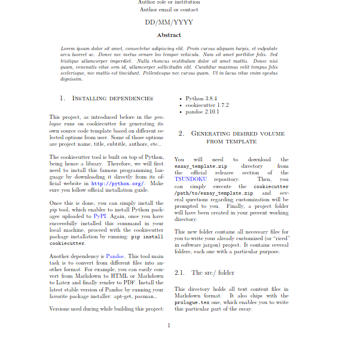
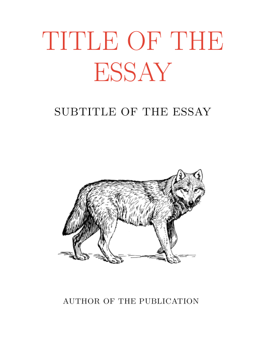

Tsundoku: books and libraries templates
=======================================

This repository holds a collection of custom and raw templates based on
different tools such us cookiecutter and pandoc, for either writing source code
libraries or academical essays. 

> The name "Tsundoku" is a term from Japanese language which refers to the
> action of buying any kind of readable materials but which will never be
> completely read because of their insane amount.


Article template
----------------



Writing articles is the best way to share your scientific discoveries. This
template focuses on writing content through simplicity but without loosing an
academical layout. Notice that the article templates holds a two column
structure, making it ideal for having a raw idea of the final report.

As other templates located in this hub, it is based on the cookiecutter tool so
you can easily setup your own settings: title, author name, role, contact,
date... All article source text files are place inside the `src/` directory
while figures and images do on `fig/` folder. Execute the `make` command within
generated project folder to render final PDF file which holds a brief tutorial
on main features of the template and how to use those.

To start creating your own template, you will need to download the associated
cookiecutter `*.zip` file and read it with this particular tool by simply
running:

```bash
cookiecutter https://github.com/jorgepiloto/tsundoku/releases/download/0.1/article_template.zip
```

Essay template
--------------



Some time ago, I found an old book titled "El Universo y nosotros" by A. F.
Marfeld. It contains the most beautiful format I have ever seen within a volume
and wanted to recreate it in an easy way by making use of Markdown, LaTeX and
pandoc.

The table of contents is controlled by a file called `toctree.txt` which holds
different links to markdown files inside the `src/` directory. Each one of those
is assumed to be a chapter of the final essay. Any kind of figure must be placed
inside the `fig/` directory in order to be properly linked once all source files
are compiled.

Future ideas and improvements for this template are still being considered:
check suitable font family, simplify LaTeX files and improve code highlighting.

Build your own template by simply running:

```bash
cookiecutter https://github.com/jorgepiloto/tsundoku/releases/download/0.1/essay_template.zip
```
